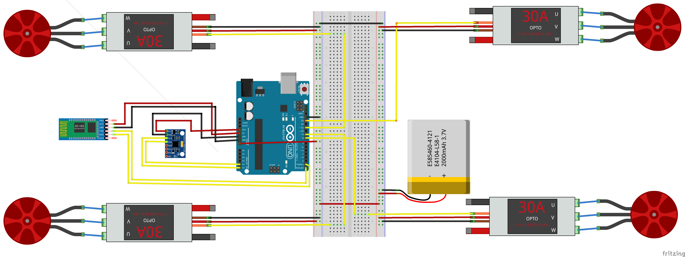

# Arduino Quadcopter

This project consists of two parts, a flight controller and a remote controller.

## Flight controller

The flight controller runs on the Arduino Uno and is responsible for calculating the quadcopter's current angle and stabilize it from there.
Additionally it takes the remote controller's input so that the user can control the quadcopter.

## Remote controller

The remote controller runs on a computer. The program is written in Processing and is used as the remote controller for the quadcopter. For this purpose the computer is connected to the Arduino running the flight controller via USB.

> **Note:** This is for testing purpose only and might hopefully changed later on as soon as the quadcopter seems to be stable enough for flying.

## Setup

The quadcopter consists of the following parts:

- **Arduino Uno** as flight controller
- **MPU6050** as gyro
- **HC-05** as bluetooth dongle for the drone
- **DJI F450** for the frame

## Wiring

The following pictures shows the wiring of the components.
> **Note:** The battery shown, is not the one used on the drone

